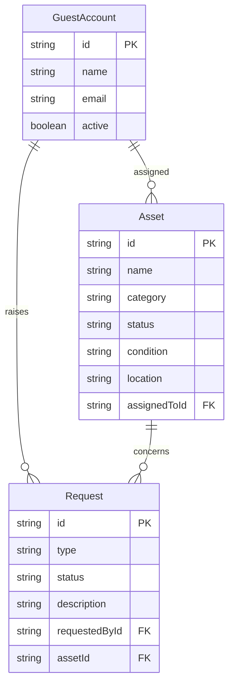

# Domain Model

The system tracks office equipment assets, the guest accounts an Admin provisions, and the requests guests raise against that inventory.

- **GuestAccount**: an employee an Admin has provisioned; identified at sign-in by the same email as their Thunder identity.
- **Asset**: one inventory item; `assignedToId` links it to the GuestAccount currently responsible for it, and is optional (unassigned stock).
- **Request**: raised by a GuestAccount, either `new-equipment` (no `assetId`) or `issue` (against an existing `assetId`); `status` moves through `open`, `approved`, `rejected`, `resolved`.

