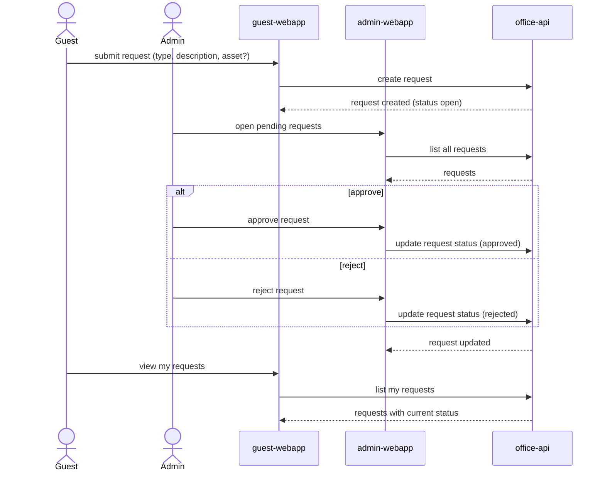

# Guest Request Lifecycle

A Guest raises a request against the shared inventory; an Admin reviews it and sets its outcome, which the Guest then sees reflected on their own request.

```mermaid
sequenceDiagram
    actor Guest
    actor Admin
    participant guestapp as guest-webapp
    participant adminapp as admin-webapp
    participant api as office-api

    Guest->>guestapp: submit request (type, description, asset?)
    guestapp->>api: create request
    api-->>guestapp: request created (status open)

    Admin->>adminapp: open pending requests
    adminapp->>api: list all requests
    api-->>adminapp: requests

    alt approve
        Admin->>adminapp: approve request
        adminapp->>api: update request status (approved)
    else reject
        Admin->>adminapp: reject request
        adminapp->>api: update request status (rejected)
    end
    api-->>adminapp: request updated

    Guest->>guestapp: view my requests
    guestapp->>api: list my requests
    api-->>guestapp: requests with current status
```

